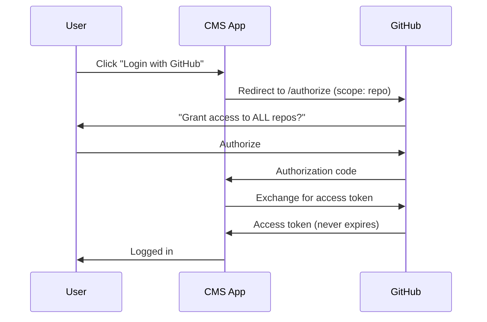
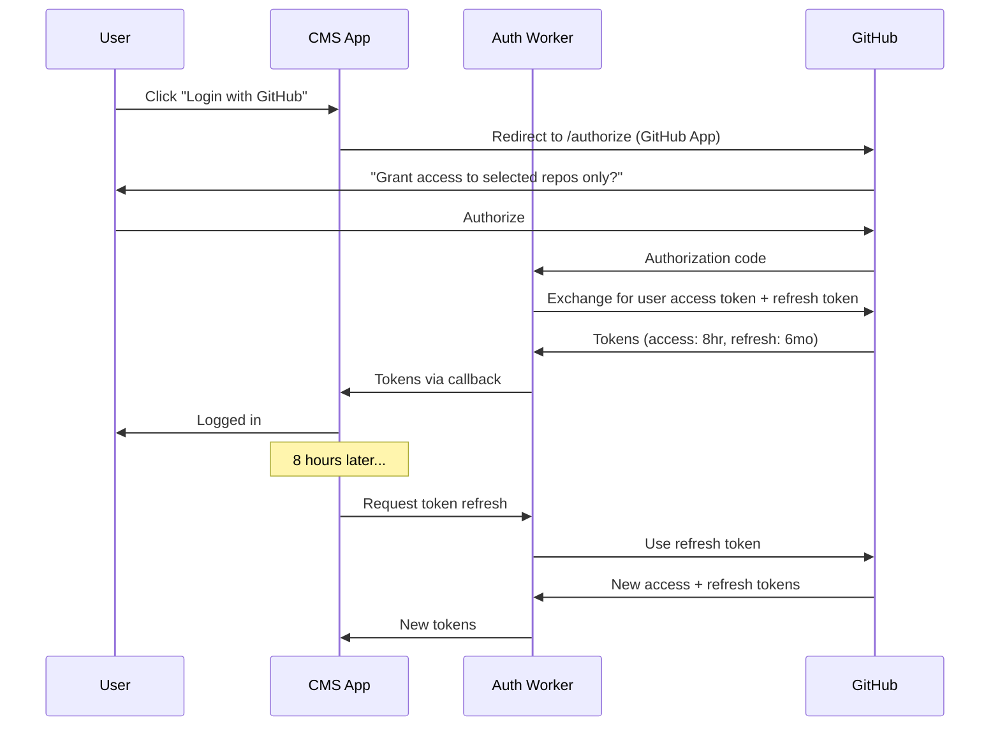

# GitHub Apps Migration Report

**Date**: January 3, 2026  
**Project**: Capsulo CMS  
**Current Auth**: GitHub OAuth App  
**Target**: GitHub App  

---

## Executive Summary

**✅ Migrating to GitHub Apps is RECOMMENDED** for Capsulo CMS. GitHub Apps offer significantly more granular permissions, repository-specific access, and enhanced security compared to OAuth Apps. This migration will:

- Allow users to grant access to **only the specific repository** they need
- Use **short-lived tokens** (8 hours) with automatic refresh for enhanced security
- Provide a more **professional installation experience**
- Remove the scary "access to all repositories" permission request

---

## Current State: OAuth App Limitations

### Issues with OAuth Apps

| Issue | Impact |
|-------|--------|
| **Broad Scopes** | `repo` scope grants access to ALL user repositories |
| **Long-lived Tokens** | Access tokens never expire (until manually revoked) |
| **User-tied Access** | Access is lost if the authorizing user leaves the organization |
| **Over-permissioning** | Cannot request repository-specific permissions |
| **User Concern** | Users are uncomfortable granting access to all repositories |

### Current OAuth App Flow

```
User clicks "Login with GitHub"
        ↓
GitHub shows: "This app will have access to:
   - All public and private repositories"  ← SCARY!
        ↓
User hesitates or declines
```

---

## Target State: GitHub App Benefits

### Advantages of GitHub Apps

| Feature | OAuth App (Current) | GitHub App (Target) |
|---------|--------------------|--------------------|
| **Repository Access** | All repos via `repo` scope | User selects specific repos |
| **Permission Granularity** | Coarse scopes | 50+ fine-grained permissions |
| **Token Lifetime** | Never expires | 8 hours (with refresh tokens) |
| **Installation Model** | User authorizes | App is installed on repos |
| **Organization Persistence** | Lost if user leaves | Persists independently |
| **Rate Limits** | 5,000/hour per user | 5,000/hour per installation |
| **Webhook Support** | Limited | Full webhook integration |

### GitHub App Permission Model

```
User clicks "Install Capsulo CMS"
        ↓
GitHub shows: "This app requests:
   - Contents: Read & Write
   - Metadata: Read only
   
   Select repositories:
   ○ All repositories
   ● Only select repositories:
      ☑ oriolmontcreus/capsulo"  ← VERY SPECIFIC!
        ↓
User confidently installs
```

---

## Authentication Flow Comparison

### OAuth App (Current)



### GitHub App (Target)



---

## Implementation Plan

### Phase 1: Create GitHub App

1. Go to **GitHub Settings → Developer settings → GitHub Apps**
2. Click **"New GitHub App"**
3. Configure the app:

| Setting | Value |
|---------|-------|
| **GitHub App name** | `Capsulo CMS` |
| **Homepage URL** | `https://your-cms-url.com` |
| **Callback URL** | `https://capsulo-auth-production.omcdev9.workers.dev/callback` |
| **Setup URL** | (optional) `https://your-cms-url.com/admin` |
| **Webhook** | Deactivate (uncheck "Active") |
| **Post installation** | Redirect users to setup URL |

4. **Permissions** (Repository permissions):

| Permission | Access Level |
|------------|-------------|
| **Contents** | Read and write |
| **Metadata** | Read-only |

5. **User permissions** (Account permissions):

| Permission | Access Level |
|------------|-------------|
| **Email addresses** | Read-only |

6. **Where can this app be installed?**: Any account

7. After creation:
   - Note the **App ID**
   - Note the **Client ID**
   - Generate and save the **Client secret**
   - Generate and download the **Private key** (.pem file)

---

### Phase 2: Update Cloudflare Worker

Update `workers/github-oauth/src/index.ts` to handle GitHub App authentication:

#### Key Changes

1. **Different Authorization URL**:
   - OAuth App: `https://github.com/login/oauth/authorize`
   - GitHub App: `https://github.com/login/oauth/authorize` (same URL, but different behavior)

2. **Token Endpoint Differences**:
   - GitHub App tokens include `refresh_token` and `expires_in`
   - Need to store and manage refresh tokens

3. **New Secrets Required**:
   - `GITHUB_APP_ID` - The App ID
   - `GITHUB_CLIENT_ID` - Client ID (different from OAuth App)
   - `GITHUB_CLIENT_SECRET` - Client secret (different from OAuth App)

#### Updated Worker Flow

```typescript
// Auth initiation - similar but uses GitHub App client ID
function handleAuthStart(request: Request, env: Env): Response {
  const authUrl = new URL('https://github.com/login/oauth/authorize');
  authUrl.searchParams.set('client_id', env.GITHUB_APP_CLIENT_ID);
  authUrl.searchParams.set('redirect_uri', `${getWorkerUrl(request)}/callback`);
  // Note: No 'scope' for GitHub Apps - permissions are defined in app settings
  authUrl.searchParams.set('state', state);
  // ...
}

// Callback handling - now receives refresh token too
async function handleCallback(request: Request, env: Env): Promise<Response> {
  // Exchange code for tokens
  const tokenResponse = await fetch('https://github.com/login/oauth/access_token', {
    method: 'POST',
    headers: { 'Accept': 'application/json', 'Content-Type': 'application/json' },
    body: JSON.stringify({
      client_id: env.GITHUB_APP_CLIENT_ID,
      client_secret: env.GITHUB_APP_CLIENT_SECRET,
      code,
    })
  });

  const tokenData = await tokenResponse.json();
  // tokenData now includes:
  // - access_token (expires in 8 hours)
  // - refresh_token (expires in 6 months)
  // - expires_in (seconds until access token expires)
  // - refresh_token_expires_in (seconds until refresh token expires)
  
  // Return tokens to frontend
  return redirectToFrontend(env, {
    token: tokenData.access_token,
    refresh_token: tokenData.refresh_token,
    expires_in: tokenData.expires_in,
    // ...
  });
}

// NEW: Token refresh endpoint
async function handleTokenRefresh(request: Request, env: Env): Promise<Response> {
  const { refresh_token } = await request.json();
  
  const tokenResponse = await fetch('https://github.com/login/oauth/access_token', {
    method: 'POST',
    headers: { 'Accept': 'application/json', 'Content-Type': 'application/json' },
    body: JSON.stringify({
      client_id: env.GITHUB_APP_CLIENT_ID,
      client_secret: env.GITHUB_APP_CLIENT_SECRET,
      grant_type: 'refresh_token',
      refresh_token,
    })
  });

  return new Response(JSON.stringify(await tokenResponse.json()), {
    headers: { 'Content-Type': 'application/json', ...getCORSHeaders(request, env) }
  });
}
```

---

### Phase 3: Update Frontend Token Management

#### Changes Required to `src/lib/auth.ts`

```typescript
// Storage keys for GitHub App tokens
const STORAGE_KEYS = {
  ACCESS_TOKEN: 'github_access_token',
  REFRESH_TOKEN: 'github_refresh_token',
  TOKEN_EXPIRES_AT: 'github_token_expires_at',
  USER_DATA: 'github_user_data',
} as const;

// Store tokens with expiration
export function storeAuthData(
  accessToken: string, 
  refreshToken: string,
  expiresIn: number,
  user: GitHubUser
): void {
  const expiresAt = Date.now() + (expiresIn * 1000);
  
  localStorage.setItem(STORAGE_KEYS.ACCESS_TOKEN, accessToken);
  localStorage.setItem(STORAGE_KEYS.REFRESH_TOKEN, refreshToken);
  localStorage.setItem(STORAGE_KEYS.TOKEN_EXPIRES_AT, expiresAt.toString());
  localStorage.setItem(STORAGE_KEYS.USER_DATA, JSON.stringify(user));
}

// Check if token needs refresh (e.g., 5 minutes before expiry)
export function isTokenExpiringSoon(): boolean {
  const expiresAt = localStorage.getItem(STORAGE_KEYS.TOKEN_EXPIRES_AT);
  if (!expiresAt) return false;
  
  const expiryTime = parseInt(expiresAt, 10);
  const fiveMinutes = 5 * 60 * 1000;
  
  return Date.now() > (expiryTime - fiveMinutes);
}

// Refresh token via worker
export async function refreshToken(authWorkerUrl: string): Promise<boolean> {
  const refreshToken = localStorage.getItem(STORAGE_KEYS.REFRESH_TOKEN);
  if (!refreshToken) return false;
  
  try {
    const response = await fetch(`${authWorkerUrl}/refresh`, {
      method: 'POST',
      headers: { 'Content-Type': 'application/json' },
      body: JSON.stringify({ refresh_token: refreshToken }),
    });
    
    if (!response.ok) return false;
    
    const data = await response.json();
    
    // Store new tokens
    storeAuthData(
      data.access_token,
      data.refresh_token,
      data.expires_in,
      await getUserFromStorage()
    );
    
    return true;
  } catch {
    return false;
  }
}
```

#### Add Token Refresh Hook

```typescript
// src/hooks/use-token-refresh.ts
import { useEffect } from 'react';
import { isTokenExpiringSoon, refreshToken } from '@/lib/auth';
import capsuloConfig from '@/capsulo.config';

export function useTokenRefresh() {
  useEffect(() => {
    // Check token status every minute
    const interval = setInterval(async () => {
      if (isTokenExpiringSoon()) {
        const success = await refreshToken(capsuloConfig.app.authWorkerUrl);
        if (!success) {
          // Token refresh failed - redirect to login
          window.location.href = '/admin/login';
        }
      }
    }, 60 * 1000);
    
    return () => clearInterval(interval);
  }, []);
}
```

---

### Phase 4: Update OAuth Callback Page

Update `src/pages/admin/oauth-callback.astro` to handle refresh tokens:

```typescript
// In the completeLogin function
if (token) {
  const refreshToken = params.get('refresh_token');
  const expiresIn = parseInt(params.get('expires_in') || '28800', 10);
  
  // ... validate token and get user data ...
  
  // Store all token data
  localStorage.setItem('github_access_token', token);
  localStorage.setItem('github_refresh_token', refreshToken);
  localStorage.setItem('github_token_expires_at', (Date.now() + expiresIn * 1000).toString());
  localStorage.setItem('github_user_data', JSON.stringify(userData));
  
  window.location.href = '/admin';
}
```

---

### Phase 5: Update GitHubAPI Client

Add token refresh awareness to `src/lib/github-api.ts`:

```typescript
import { isTokenExpiringSoon, refreshToken } from './auth';
import capsuloConfig from '@/capsulo.config';

export class GitHubAPI {
  // ... existing code ...
  
  private async ensureValidToken(): Promise<void> {
    if (isTokenExpiringSoon()) {
      const success = await refreshToken(capsuloConfig.app.authWorkerUrl);
      if (success) {
        // Update the token in this instance
        this.token = localStorage.getItem('github_access_token') || '';
      }
    }
  }
  
  private async fetch(endpoint: string, options: RequestInit = {}) {
    // Ensure token is valid before making request
    await this.ensureValidToken();
    
    // ... existing fetch logic ...
  }
}
```

---

## Migration Strategy

### Option A: Clean Migration (Recommended)

1. Create new GitHub App
2. Update worker with new credentials
3. Delete old OAuth App
4. Users re-authenticate with new GitHub App

**Pros**: Clean slate, no legacy code  
**Cons**: All users must re-login

### Option B: Parallel Support

1. Create new GitHub App
2. Update worker to support both OAuth App and GitHub App
3. Gradually migrate users
4. Eventually deprecate OAuth App

**Pros**: No forced re-login  
**Cons**: More complex code, longer transition

### Recommendation

**Option A** is recommended for Capsulo CMS because:
- The CMS likely has few active users during development
- Clean migration avoids technical debt
- GitHub App benefits are immediately available to all users

---

## Files to Modify

### Worker Updates

| File | Changes |
|------|---------|
| `workers/github-oauth/src/index.ts` | Add token refresh endpoint, update auth flow |
| `workers/github-oauth/wrangler.toml` | Update with new secret names |

### Frontend Updates

| File | Changes |
|------|---------|
| `src/lib/auth.ts` | Add refresh token storage and management |
| `src/hooks/use-token-refresh.ts` | New hook for automatic token refresh |
| `src/lib/github-api.ts` | Add token refresh before API calls |
| `src/pages/admin/oauth-callback.astro` | Handle refresh token from callback |
| `src/components/admin/AuthProvider.tsx` | Integrate token refresh hook |

---

## Security Improvements

| Aspect | OAuth App | GitHub App |
|--------|-----------|------------|
| **Token Lifetime** | Indefinite | 8 hours |
| **Refresh Tokens** | Not available | 6 month lifetime |
| **Rotation** | Manual revocation | Automatic on refresh |
| **Repository Scope** | All repos | User-selected repos only |
| **Permission Model** | Coarse scopes | Fine-grained permissions |

---

## Implementation Effort

| Phase | Effort | Priority |
|-------|--------|----------|
| Create GitHub App | 30 min | High |
| Update Worker | 3-4 hours | High |
| Update Auth Library | 2-3 hours | High |
| Add Token Refresh Hook | 1-2 hours | High |
| Update OAuth Callback | 1 hour | High |
| Update GitHubAPI Client | 1-2 hours | Medium |
| Testing | 2-3 hours | High |
| Documentation | 1 hour | Medium |
| **Total** | **~12-16 hours** | |

---

## Conclusion

Migrating from OAuth App to GitHub App is highly recommended because:

1. **Better Security**: Short-lived tokens with automatic refresh
2. **Granular Permissions**: Users choose specific repositories
3. **Improved UX**: No scary "access all repos" permission screen
4. **Future-Proof**: GitHub Apps are the recommended authentication method
5. **Professional**: Installation-based model feels more polished

The migration requires moderate effort (~12-16 hours) but provides significant security and UX improvements that justify the investment.

---

## Next Steps

1. **Review this report** and confirm migration approach
2. **Create GitHub App** in GitHub Developer Settings
3. **Backup current worker code** (it's already in the repo)
4. **Implement Phase 2-5** changes
5. **Test thoroughly** in development
6. **Deploy** updated worker and frontend
7. **Delete old OAuth App** once migration is complete
